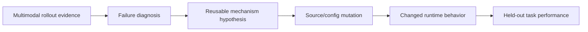

# Self-Evolving Multimodal Agent Harness

更新：2026-09-13。**本文件是唯一当前总览入口**；依据实际源码、来源锁与不可变实验记录维护。
本次是研究抽象与接口重构，只执行本地静态/fixture 测试，未启动 GPU、模型、ClusterX 或 benchmark rollout。
新 benchmark 的 source integration 不代表真实执行或评分通过。

导航：[定义](#research) · [架构](#architecture) · [提案](#proposal) · [媒体](#media) ·
[流程](#workflow) · [任务池](#portfolio) · [参数](#configuration) · [历史](#experiments) ·
[兼容与代码](#compatibility) · [研究问题](#questions) · [验收与下一步](#next)

<a id="research"></a>
## Research Definition / Evolution Object

**Generic agent harness** 是位于模型权重之外，管理 execution loop、tools、context/state、lifecycle、
budget/recovery 和 verification 的可执行 runtime。模型 API 能接收 image 不是 multimodal harness 的充分定义。

**Multimodal harness**：`H_MM = H_generic + Pi_MM`，其中 `Pi_MM` 是显式控制 observation、media state、
context、grounding 和 inference-time verification 的可执行多模态策略集合。

`H_(k+1) = Evolver(H_k, trajectory_k, media_k, evaluation_k)`。
模型/provider/weights 固定，Evolver 修改 runtime 的 source/config policies；不能表述为“训练或提升模型视觉能力”。
主实验 A＝B 是同一模型 revision、独立会话和角色配置，不要求相同 agent 框架。
评分 VLM、GUI grounding model 等是独立固定组件，版本/费用单列。

核心因果链：



每条箭头都需要证据。一个 diff、一次成功或 benchmark 的多模态名称都不能补齐整条因果链。
Generic improvement 可以保留，但不能计为 multimodal-specific gain。

<a id="architecture"></a>
## Harness Architecture / Multimodal Control Plane

| 层 | 职责 | 研究边界 |
|---|---|---|
| 固定 B outer runtime | workspace、主动查证、提案/版本/评测调度、历史 | 第一阶段不进化；工程修复单列 |
| 可进化 A task harness | generic runtime 与 Pi_MM 的 executable policies | 主要进化对象，按实际 H0 source/config 定位 |
| 固定 benchmark | 数据、环境权限、官方评分、答案、协议 | 不可修改；评分侧材料不提供给 A/B |
| 固定 model/provider | 权重、模型版本、采样、请求/时间总预算 | 在候选 source 外固定；内部可分配但不能提高总额 |

**Execution-time multimodality**：A 如何执行下面六个 stage。
**Evolution-time multimodality**：B 如何读取 A 真正产生的媒体与轨迹，形成诊断及修改。
B 看过图片不能证明 A 有视觉验证；scorer 使用 VLM 更不能证明 A 的 Verify。

| Pi_MM stage | 控制内容 | 可观测例子 |
|---|---|---|
| Acquire | 何时、从何处、以何粒度重新观察；截图、render、reopen、audio/video 获取、选帧触发 | UI source 修改后产生一次新 render/screenshot |
| Transform | crop/zoom/resize、frame/segment selection、diff/contact sheet、ROI、OCR/媒体派生摘要 | crop 的父 artifact、区域、变换链及实际新文件 |
| Persist | 稳定 identity/hash、source event/tool、创建 step、父子关系、provenance、freshness/re-access | retained 图仍在，但界面 revision 改变后标 stale |
| Route | 当前/历史图与派生表征的选择、顺序、预算、检索和 revisit | 某 artifact 以 pixels/summary/frames 进入指定 request |
| Ground | 图像/场景/时间片段绑定到 entity/action semantics | 旧 GUI element 失效后重新定位；普通 shell 不是 Ground |
| Verify | A 在 runtime 内取得/利用媒体检查结果，决定 repair/retry/continue/stop | action → fresh screenshot → inspect effect → repair |

边界判据：**移除 pixels/video/audio/rendered visual state 后，若机制语义基本不变，它就是 generic。**
通用 timeout/retry、patch 格式校验、shell 恢复、纯文本上下文压缩属于 generic。
“stale screenshot 不再路由”“动画按多帧诊断”“stop 前 fresh render 检查”才具有明确媒体依赖。
修改视觉编码器不属于 harness evolution；仅追加“仔细看图片”不能直接声称一个 MM 机制已生效。

<a id="proposal"></a>
## Mechanism Proposal 与旧 taxonomy 迁移

新提案使用两个正交轴：`scope`（即 mechanism_scope）与 `primary_mm_stage + secondary_mm_stages`；
`modalities` 描述媒体类型，不使用 benchmark 名。`mm_stages` 在 Python 中由主/次 stage 派生。
合法 modalities 为 image、video、audio、gui、rendered_artifact、document_visual、mixed。

| 旧标签（仅 legacy implementation tags） | 新机制可能分类，必须重新依据机制语义判断 |
|---|---|
| prompt_context | 通常 generic；具体媒体选择/表示可属 Route 等 |
| visual_observation | 可能 Acquire / Transform / Persist / Route；不自动归 MM |
| history_memory | 通用压缩是 generic；media identity/freshness/retrieval 可属 Persist / Route |
| tool_orchestration | 普通工具编排是 generic；图像依赖的动作可属 Ground / Acquire 等 |
| retry_stop | 普通重试是 generic；stop 前视觉检查可属 Verify |
| internal_verification | 单元测试触发通常 generic；runtime render/inspect 可属 Verify |

**上表是新提案分析提示，不是历史数据自动转换表。** 旧记录加载为 `legacy_taxonomy`，新 scope/stages/modalities
为 null，不根据旧标签推断 generic/MM，也不回写 JSON。

权威 Python schema：[core/mechanisms.py](../src/mm_harness/core/mechanisms.py)。`MechanismPatch` 字段：

| 字段 | 约定 |
|---|---|
| schema / proposal_id | `mechanism-patch/v1` / 稳定提案 identity |
| scope | generic 或 multimodal_specific |
| primary_mm_stage / secondary_mm_stages | generic 为 null/[]；MM 必须有合法 primary，可有不同的 secondary |
| modalities | 上述媒体 enum 列表；MM 至少一个 |
| failure_class / failure_hypothesis | 五类失败之一与机制假设；generic/MM mutation 分别要求对应 harness failure |
| evidence_refs / media_evidence_refs | workspace 中确实存在的事件引用 / artifact IDs；MM 必须有媒体，且与引用事件关联 |
| mechanism_description / why_generic_or_multimodal | 可复用机制与移除媒体后的反事实判断 |
| media_dependency | generic 为 null；MM 必须描述为何依赖媒体 |
| expected_runtime_trigger | `{event_kind, description, match}`；是可观察行为事件，不能是 score/gain |
| expected_behavior_change | 与当前父版本不同的实际行为 |
| implementation_targets | 与真实 diff 完全对应的 source-relative 文件列表 |
| budget_effect / invariants / risk_or_possible_regression | 预算影响、固定不变量、可能退化 |
| source_diff / frozen_candidate_identity | B 可留 null；controller 检查后绑定实际 patch 与快照 hash |

例如：修改 UI 后、stop 前 fresh render，并将对应 revision 的新 artifact 实际送入下一次 request。
不是“应提高 UI 分数”。`mechanism-patch.json` 是 controller 绑定版本后的记录；B 原始提案与 diagnosis 仍原样归档。

<a id="media"></a>
## Evidence Model / MediaArtifact / MediaUse

继续使用 `events.jsonl`、内容寻址媒体文件与索引；新抽象是这一存储的 canonical view，不另建不兼容数据库。
[core/media_artifacts.py](../src/mm_harness/core/media_artifacts.py) 定义：

| MediaArtifact 字段 | 含义 |
|---|---|
| schema / artifact_id | `media-artifact/v1`；一次 observation occurrence 的稳定 identity，不等于内容 hash |
| modality / content_hash / storage_ref | 媒体类型、原始落盘字节 SHA256、文件引用；缺失身份/内容不能猜测 |
| source_event_id / source_tool_call_id / created_step | 来源事件、工具调用、创建 step；旧轨迹缺失可 null |
| parent_artifact_ids / transform_chain | crop/frame/contact sheet 的原媒体与变换链；支持多父产物 |
| metadata | width/height、duration_seconds、timestamp/time-range/frame-range、MIME 等适用字段 |
| freshness_state | fresh / stale / unknown；保留文件不等于仍有效 |
| provenance | 来源、环境/代码 revision、parent hashes、原始/派生关系及未知项 |

`content_hash` 是文件内容 hash，不冒称解码后像素 hash；如果需要 pixel hash 可额外记 metadata。
两个新截图可以像素相同而 observation identity 不同。历史 hash 无法唯一定位 parent 时保留 unresolved。
`derive_artifact` 在验证父文件 hash 后建立链；复用已有 crop/frame 文件工具，不往 JSON 塞大媒体。

`MediaUse`（`media-use/v1`）记录 use_id、artifact_id、request_id、role A/B、representation、selection_reason、
mm_stage、freshness_state、readable、passed_to_model、from_transform、revisit、source_event_id、transport_evidence。
`understood_correctly` 固定未知，不能由转发推断。freshness 是使用时快照，不能靠修改旧 artifact 补造历史。

**collected ≠ readable ≠ passed to model ≠ correctly understood。**

- 新 workspace schema 5 保留旧索引，增加 media-artifacts.json、media-availability.json、media-uses.json 和总 media-catalog。
- 仅有 artifact 时不生成“已消费”事实。旧 model_request 缺可靠 transport 标记时 passed 保留 null。
- 固定 OpenAI/Anthropic gateway 为未来请求生成 media-audit sidecar；成功 generation 响应对应的内嵌 bytes 记已传入。
  失败 HTTP/网络状态保留未知，count_tokens 明确不是 generation；文本中的 data URI 不算原生媒体块。
- 原始请求、响应和 hash 仍保留。网关仅能给出请求级 observation identity，不能根据同 hash 猜原始截图 identity、
  freshness 或 revisit；需要 A runtime 提供 provenance。URL-only 媒体的服务端实际内容暂未核验。
- 当前 B Claude Read 支持 image；原始 video/audio 和派生 provenance 可存储/索引，但 B 原生听音/连续视频接口尚未接入。
  不把文件路径或 keyframe Read 冒称观看整段视频。

<a id="workflow"></a>
## Evolver/B Workflow 与运行时可观测性

B 仍是一个固定 Claude Code 会话中的自主查证，不拆成十个硬编码 LLM 节点。
新 prompt：[mechanism-evolver-v1.txt](../configs/prompts/mechanism-evolver-v1.txt)。逻辑顺序：

1. 读 task/score/failure overview；成功案例作为必要对照。
2. 查真实 events，按需看媒体；不能只依据摘要。
3. 分为 generic_harness / multimodal_harness / model_capability / environment_evaluator / insufficient_evidence。
4. 形成 reusable mechanism hypothesis，读当前源码确认机制缺陷或缺失。
5. **修改前保存 diagnosis.json**（identity、classification、事实/假设/不确定性、source_checks）。
6. 修改边界内 source/config；提交 generic/MM MechanismPatch，或 no_change。
7. controller 验证格式、真实 evidence ID/媒体关联、source locations、diff 范围和语法，冻结版本。
8. 候选 rollout 才检查 trigger/behavior；后续比较独立开发任务与冻结后的 T。

Diagnosis-before-edit 是指令约定，不是工具时序强制屏障；最终提交会检查诊断结构和关联，但不能证明 B 阅读理解正确。
媒体索引存在也不能证明 B 实际看图；B gateway 的实际请求记录是进一步查证入口。
模型能力、环境/评分器故障或证据不足时允许 no_change；不能伪造 visual failure 来凑 MM 提案。

[core/observability.py](../src/mm_harness/core/observability.py) 提供轻量 `MechanismRecorder`：artifact、use、behavior 事件。
统计 media acquisitions、transformed artifacts、media presentations/revisits、fresh/stale/unknown routed、
grounded multimodal actions、runtime MM verification。A 与 B 分开；evaluator 不计为 Verify。

实现与触发是两个轴：`implementation_status=implemented/unknown`，`trigger_status=triggered/not_triggered/trigger_unknown`。
只有匹配 proposal_id、事件类型及 match 字段的 runtime 事件才记 triggered；只有覆盖完整且未观察到才可记 not_triggered。
默认 incomplete coverage 下计数是下界，缺失事件不是零行为证明。即使 triggered 也不代表诊断正确、机制有效或已泛化。

当前 SWE 新请求可导出 gateway MediaUse；各具体 runtime 的 freshness/grounding/verification hook 尚未完整植入。
候选 E 结果会保存 `mechanism-observations.json`，随父/候选、patch 和评分进入历史；没有 instrumentation 时如实 unknown。

### 外层 search policy（provisional experimental policy）

保留 `current_parent_with_history`：当前父版本跑 E4 → B 一个候选 → 同 E4 逐题重跑 → E 均分严格提高才进 V4 →
V 均分不降则更新 → 归档 → 下一轮。未修好的个别题不被剔除；不改 bootstrap 阈值，也不增加更大 V 晋升门。
E/V 按 seed 分别逐批遍历；不足尾批不补重复题；一题一次采样、每轮一个候选、默认三轮。
干净环境、任务/model/protocol/harness identity 对齐；运行故障独立记 inconclusive。只有 E 原始轨迹提供 B，V 只给汇总，T 冻结后使用。
中断 proposal workspace 不覆盖；历史 rejected/no_change 均保留。无跨轮完整预算管理、主动分支选择、多父合并或正式统计门。
这些是开发搜索设置，不包装成 Pi_MM 的理论贡献。

<a id="portfolio"></a>
## Benchmark Portfolio / Benchmark Roles

权威 registry 是各目录的 `mechanism-profile.json`，由 `BenchmarkMechanismProfile` 校验。
旧 `profile.json` 保留为历史 adapter 配置，不再决定 active research pool。
CLI 默认六个 active，`--all` 或 `--status archived` 可查看两个归档兼容入口。ChartMimic/VisualWebArena 已移除当前 registry。
`status` 表示研究角色，`integration_status` 表示证据级别，两者不能混淆。

| Active benchmark | 机制角色 / 重点 stages | 当前 H0 / media policy | 实际 integration |
|---|---|---|---|
| [swe_mm](../benchmarks/swe_mm/mechanism-profile.json) | static-MM coding anchor；六阶段可作扩展点，不是现成 active-feedback 优势 | 官方 SWE-agent 多模态配置；issue images + 显式 image/browser tools | scoring_validated：仅历史单题执行评分；0 轮真实进化 |
| [gamedevbench](../benchmarks/gamedevbench/mechanism-profile.json) | active image/video；Acquire/Transform/Persist/Route/Verify；Ground 待接口核对 | 官方 OpenHandsSolver 视觉反馈 recipe，未冻结 | planned：保留 adapter skeleton |
| [vision2web](../benchmarks/vision2web/mechanism-profile.json) | prototype → rendered state → repair；六阶段 | 官方 OpenHandsAdapter；具体 A 媒体策略还取决于 OpenHands runtime | source_integrated；原生 CLI/loading 检查不等于有效 rollout |
| [osworld_verified](../benchmarks/osworld_verified/mechanism-profile.json) | visual state → grounded GUI action → new state；Acquire/Persist/Route/Ground/Verify | Agent-S S3 单轨迹 recipe；grounding model 另固定 | planned；VM/reset/版本待接 |
| [agentic_vbench](../benchmarks/agentic_vbench/mechanism-profile.json) | temporal audio/video、frame/segment、output revisit；Acquire/Transform/Persist/Route/Verify | 官方 Harbor agent recipe；没有唯一的官方媒体 runtime，A 实现还未选定/冻结 | source_integrated；静态发现默认 100 题 |
| [browsecomp_v3](../benchmarks/browsecomp_v3/mechanism-profile.json) | cross-modal evidence acquisition/provenance；六阶段 | 官方 OmniSeeker；initial/tool images、compression、MCP search | source_integrated；本次未下载/解密数据、无真实执行 |

每个 profile 均记录 initial/active media availability、interactive environment、agent-visible/evaluator-only materials、
开发/heldout 数据状态、真实 generic/MM 失败证据和 headroom。availability 表示任务/上游支持，不表示本地服务已验证。
当前 SWE MM headroom=unknown：已有 timeout/format 不是 MM 证据。其他 active 的 plausible 是研究假设，均没有 confirmed MM failure。

| 数据/评分边界 | 当前判断 |
|---|---|
| SWE-MM | 官方 dev 102 可用于研究划分；official test 留 T。官方测试无额外 judge；已知外部网络依赖/污染需解决 |
| GameDevBench | 没有批准的独立开发池；Godot 官方测试待接，媒体策略与 Ground 需实码定位 |
| Vision2Web | 本地 193 题是 released evaluation pool；workflow/scorer 图片不是 A 默认输入；官方评价可能用模型 |
| OSWorld-Verified | 未批准独立开发池；环境/评测/独立 grounding model 均需固定 |
| AgenticVBench | 论文四家族 100 题；当前源码另有 understanding 24 题，默认不混入。未确认独立 dev；repurpose judge 含模型费用 |
| BrowseComp-V3 | `data/train.jsonl` 是下载布局，不是独立 dev 的证据；answer/sub_goals/评价 metadata 不导出到 A；官方 judge 可能产生额外模型费用 |

| 清理对象 | 当前状态 | 定位与历史 |
| --- | --- | --- |
| [design2code](../archive/benchmarks/design2code/README.md) | archived | static screenshot-to-code；历史负闭环只属工程验证，保留实现与历史读取 |
| chartmimic | removed | 删除未验证的占位 adapter/H0/开发配置；来源与 Git 历史保留 |
| visualwebarena | removed | 删除未验证的占位 adapter/H0/开发配置；来源与 Git 历史保留 |
| [claw_eval_mm](../archive/benchmarks/claw_eval_mm/README.md) | archived | 保留实现、本地 101 题、附件及镜像来源；未来可重新接入 transfer |

Design2Code/Claw 的源码和开发配置移至 `archive/`，旧 Python import 通过 package 搜索路径继续可读。
Claw 的数据、索引和镜像资料留在原资产目录。已归档任务不进入默认 adapter 创建；显式兼容调用可 opt in。
历史 runs、frozen 源码、实验配置/结果及上游来源均未迁移。归档配置保留旧路径，复现应使用历史 frozen 版本。


### 新 upstream integration 与 mutation boundary

- AgenticVBench 官方源 `6d7f19a5832b283be6b27bf9cc0d3c1f47e97349`，Apache-2.0；
  [官方代码](https://github.com/PhiloLabs/agentic-vbench)。已下载原样归档并固定 SHA256，静态读取 task.toml/instruction，
  默认导出四个论文家族 100 题，extra flag 可列出 124；不执行 install/avb/oracle/environment scripts。
- BrowseComp-V3 官方源 `8584b33073b4e1e53c98a97608e7e5b73883dfc9`，
  [官方代码](https://github.com/Halcyon-Zhang/BrowseComp-V3)。公开 loader 会携带 answer 和任意 metadata；
  新 discovery 只导出 question + 明确 images/ 内资源，拒绝答案 JSON 被当图片路径传入。未给任务指定 E/V/T。
  README 声明 CC BY 4.0 并链接 dataset card，源码无独立 LICENSE；开源分发需继续核对，不自行重新授权。

两者提供 `CommandBenchmarkAdapter` skeleton、profile、source provenance、只读 discovery；execute/score 均为 null，
无环境时明确未配置。下载源码内的 calibration/oracle 仅作为固定上游来源，不能挂入 A/B。

新 `mutation-boundary.json` 按 stage_locations、generic_source、mutable entries、fixed 四个部分组织。
SWE 实际定位到 DefaultAgent、history processor、image/browser wrappers、submit review 和模板字段；
模型/provider、problem statement、environment/run、scorer/answers、安装和权限 wiring 固定。
YAML 只开放列明字段，其余整树保持相同；source diff 必须匹配 implementation_targets。
SWE shared methods 是扩展位置，不证明某个 stage 已完整实现。

Vision2Web 目前定位官方 adapter，不伪造外部 OpenHands 的 observation hook；AgenticVBench 的 avb 是 launcher，
不是实际 A runtime。BrowseComp 已定位 env/image_processor/image_logger/search_server，但 env 同文件混有 provider/budget，
**因此目前不给新两个任务开放 mutation**。其他未集成任务保持空 mutable/map unknown，待核对源码后再开放。
文件/字段检查不能证明任意 Python 的语义不变量；外侧模型网关、预算和权限仍须固定，真实候选需要行为检验。

<a id="configuration"></a>
## Current Configuration / Development Data

新建实验默认 `swe-mm-mechanism-pilot.json` + `qwen38-mechanism-pilot.json`，旧配置原样保留。
`prepare_swe_pilot.py --config ...` 可显式选择；本次未执行该准备/运行入口，未恢复停止作业。
新模型 actor 配置与旧值相同，只切换 B prompt/schema/boundary；旧服务 ready 路径不代表服务在线。

配置来源：[新实验策略](../configs/evolution/swe-mm-mechanism-pilot.json)、[新角色配置](../configs/models/qwen38-mechanism-pilot.json)、
[任务清单](../experiments/splits/swe-mm-pilot-v1.json)。运行时以实验目录中冻结的配置为准。

| 参数 | 当前值 | 说明 |
|---|---:|---|
| 每轮 E / V 批量 | 4 / 4 | 可配置；不是整个任务池大小 |
| 每轮候选 / 每题采样 | 1 / 1 | 尚无多候选并行搜索 |
| 最大轮数 | 3 | 最近被停止的命令请求继续 2 轮，实际完成 0 轮 |
| 任务采样 seed | 20260912 | 不保证模型或 GUI 执行逐位确定 |
| 同时进行的任务流水 | 2 | 两条 CPU 执行/评分流水共享同一两卡模型服务 |
| A 生成请求 / 总时限 | 50 / 1800 秒 | 单请求时限 300 秒 |
| B 生成请求 / CLI turns / 总时限 | 32 / 24 / 1200 秒 | 辅助模型生成计入 32，纯 token 计数不计入 |
| A/B 输出上限 | 8192 tokens | B 辅助请求可使用更小额度 |
| A/B temperature / top_p | 0.6 / 0.95 | thinking 开启 |
| 外部 scorer 时限 | 1800 秒 | 原生评分协议固定 |

本地 SWE 官方 dev 固定 revision `3548373bb5f604b55600884af34ac33e5a90ef66`，共 102 题。
**目前没有把 102 题重新划为 60% E / 40% V。** 现行 pilot 是：

| 研究用途 | 数量 | 来源/分组 |
|---|---:|---|
| E | 12 | p5.js / Chart.js |
| V | 4 | marked / react-pdf |
| 内部保留 `test_frozen_only` | 37 | wp-calypso；仍来自官方 dev，不是官方 test |
| 未使用 | 49 | 保留未加入本次 pilot |

因此当前 E 三轮遍历一次，V 每轮都是同四题。五个仓库组不足以代表完整任务分布；V 中任务的视觉机制覆盖也要再审查。
官方 test 留给冻结后的最终评价，不能用于进化。`upstream_split` 与研究用途必须分开保存；
给官方测试题改名 dev 不会把它变成开发数据。

截至已保存的 2026-09-12 来源审查，当时 SWE 之外的七个 benchmark 未发现配套的官方独立 train/dev；
Claw 的 multimodal/general/multi_turn、Vision2Web 的三个任务层级、ChartMimic 的 testmini 都不是开发划分。
它们需要另建不重叠开发任务池，或采用以后明确讨论的研究协议；不能默认在官方评测池上演化。
此处是已核对版本的记录，不代表持续在线更新的数据目录。

<a id="experiments"></a>
## Current Experiment Status / Immutable Historical Evidence

**真实 SWE-MM 进化闭环尚未完成，完成轮数为 0。** 两卡作业 2026-09-13 08:43 UTC 已 STOPPED，GPU 已释放，
相关 B/驱动/CPU 作业停止。本次未启动任何服务；新结构不产生新的实验结论。

### SWE-MM 最近一次测试

`runs/swe-q38-e4v4-20260913-v3` 的 A 执行冻结提交为 `fa77ce2`。后续固定 B 接线修复另有 Git 提交及尝试说明，
不能把整段工程重试包装成一次固定预算优化轮。主记录：[worker 来源与实测索引](../experiments/provenance/swe-native-worker-2026-09-13.json)。

| 实际记录 | 结果与范围 |
|---|---|
| `swe-native-q38-20260913-a/smoke-a`、`smoke-b` | 浏览器/proc 与启动兼容失败；非有效 H0 |
| 同目录 `smoke-c` | 真实模型输出 1701 字节补丁，独立官方评分 `resolved=false`；浏览器截图确实进入后续请求 |
| `swe-scorer-positive-control-0913` | 官方参考补丁正控，无模型求解；也遇到相同回归测试超时 |
| `q38-real-claude-probe-0913-b` | 同一 Qwen + Claude Code 真正读图并写诊断文件；独立工具探针，非 SWE 进化候选 |
| `swe-q38-e4v4-20260913-v1` | 单请求 180 秒不够导致停止，记录保留；v2 仅准备，最终改用 v3 的 300 秒 |
| v3 E4 | Chart.js-11352、Chart.js-9027、p5.js-3709 超时；Chart.js-8710 格式失败；均无提交，记零且未运行实际测试 |
| v3 B | 多次接线调试后被用户停止；最后没有 diagnosis.json 或 proposal.json，完整 workspace 保留 |

两项实际可靠性问题：

1. p5.js-6069 的模型补丁和参考补丁均为 FAIL_TO_PASS 28/28、PASS_TO_PASS 2388/2389。
   唯一失败是 loadJSON 文档示例 4 秒超时，该示例访问实时 USGS 数据。官方零分保留，不能直接归因为修复错误；
   也不能删除测试或改评分公式后声称官方通过。ClusterX scorer 作业终态 Failed 与实际评分脚本执行完成分别记录。
2. Chart.js-11352 的 A 轨迹实际通过 GitHub API 获取对应修复提交及 diff，还下载修复后的 fixture。
   这属于答案污染；当前轮只能用于工程测试，不能报告论文收益。不得通过删去轨迹片段掩盖该事实。

本轮固定外层修复：相对 sandbox 路径；内嵌图片索引；重复 query 改引用；动作摘要入口；
B 预算输入；较小辅助输出额度；token 计数/模型生成分账；永久预算耗尽停止重试。
固定 CLI 的 `CLAUDE_AUTOCOMPACT_PCT_OVERRIDE` 设为 40，以提前适配本地 128K 窗口。
这些修复是工程基础，不是 B 自动改进 A harness。

`search/rounds/round-000/` 保留 `proposal-startup-failure-000`、`proposal-interrupted-001`、
`proposal-context-failure-002`、`proposal-budget-failure-003`，最后被停止的为 `proposal/`。
各 `provider-usage.json` 汇总可获得的实际请求成本，缺失 usage 标为下界。
本轮曾完整通过 98 项测试；后续补丁的相关测试分别通过，未声称在最终提交上重新全套验证。

### 历史 Design2Code 工程验证

固定 A＝B＝Qwen3.5-9B，官方 direct 适配起点。多模态和文本候选均未通过验证，保留 H0。
H0 验证均分 0.920396；MM 候选 0.882692；文本候选 0.838566。
其中 MM 诊断声称缺失的结构实际上已有；文本提案声称自修订却只改 prompt，未实现额外修订调用。
这些负例说明需要检验“诊断—实现—触发”，不能只看反思文字。

数据取自官方评测集的历史自定义划分，因此仅作为工程验证，不符合当前“官方 test 不参与进化”要求；
历史两题冻结评估也不代表新协议下未接触的官方测试。详细分数、媒体和去重成本保留于
[结果报告](../experiments/results/design2code-smoke/README.md)。未开展等预算重试、固定视觉检查或正式重复实验。

## Environment / Source Provenance

项目路径：`/data/miyapeng/mmcode/mm-harness-evolve`。旧 `MultimodalCode` 作为只读来源和经验，未修改；
复用的任务源码、重点数据和镜像清单已集成新仓库，避免外部源码/数据软链接。
模型权重、已存在的 Python 基础环境和集群服务仍是部署依赖，不能把“源码已集成”说成完全独立发行环境。

| 组件 | 固定来源 / 用途 |
|---|---|
| SWE-agent | `3ea751c087f32b16e039a2233dd6eefecef325d5`；当前官方 H0 |
| SWE-bench | `7e578260da58400f307e435e43d1d2ab29d686f6`；评分源码 |
| AutoSaddler | `30e20ce004486c58e7ee97c66182a8d0d41ec90e`；历史 Design2Code 直接复用 V2 引擎/存储/插件；V1 仅保留论文实现来源 |
| Meta-Harness | `44b9942127847f7421db70d8c7e48407f09a3c70`；实际 vendor 复用 Claude 会话解析/日志，参考自主查证与历史管理；未复现论文 baseline |
| Vision2Web released | `577f9397b3db8fc6d828adde254a830caa65d515`；论文旧 evaluator `3111cc3` 另固定 |
| Claw-Eval | `5680b8b11ff2ee5dd2b07b89086a29a5c5c984d7`；多模态配置和官方执行/评分入口 |
| Claude | Agent SDK 0.1.39，bundled Code 2.1.49；固定 B |

完整来源与许可证见 [third_party/lock.json](../third_party/lock.json)、benchmark 的 `upstream/SOURCE.json` 和
[provenance 目录](../experiments/provenance)。保留 Vision2Web README/包元数据许可证声明冲突，不重新授权上游。
旧项目导入逐文件 hash 在 `legacy-snapshot.json`；后续来源改变不能静默覆盖冻结副本。

环境分工：控制器 `.venv`；原生配置检查 `.venv-swe-agent`；官方实例中的运行使用 `.venv-swe-worker`，
通过固定 Python 3.12 工具包装兼容上游解释器路径；评分依赖固定 swemm 环境。
当前宿主没有可用 Docker daemon，SWE 通过 ClusterX 启动固定 digest 的实例；不能把本机 CLI 成功等同于容器验证。
A 使用任务挂载与 Landlock 的 proc 兼容方案，B 使用原有 self_only sandbox；参考答案不挂入 A/B。
现有隔离不能保证严格网络消融或阻断一切答案获取，已经发生的污染见实验记录。
SWE 已记录的固定兼容措施还包括：GIF 取首/中/尾 RGB PNG 帧并保留原始媒体及 hash；
Python 工具解释器包装；将上游请求阈值设为 N−1 与外侧 N 次实际请求上限对齐。这些不改变原始 H0 提示/工具策略，
但属于复现时必须披露的人工适配，不能拿早期有兼容故障的采样作为有效 H0。

最近测试模型为本地 `/data/miyapeng/model/Qwen3.8-27B`，vLLM 0.25.1、transformers 5.14.1，两张 A800 80GB，TP=2，
非整节点独占。服务目前已停止，`ready.json` 中的旧端点不能视为在线服务。
18 个权重 shard 的完整 hash 已补齐：[权重清单](../experiments/provenance/qwen38-checkpoint-20260913.json)。
冻结旧角色配置中的“full digest pending”是历史字段，实际完整指纹以此补充清单为准，不静默改写旧实验身份。

<a id="compatibility"></a>
## Implementation / Backward Compatibility

| 位置 | 新职责 / 兼容路径 |
|---|---|
| `core/mechanisms.py` | 正交分类、MechanismPatch、RuntimeTrigger、read-only legacy loader |
| `core/media_artifacts.py` | canonical artifact/use、hash/parent/freshness、legacy media 投影 |
| `core/observability.py` | runtime recorder、role 分离、计数和 trigger 状态 |
| `core/benchmark_profiles.py`、`core/benchmarks.py` | 新研究 registry；旧 profile() 可读；归档 adapter_for() 需显式 opt in |
| `evolution/media_workspace.py`、`rollout_workspace.py` | 新 workspace sidecars 与旧 schema 4 分支 |
| `evolution/mechanism_review.py`、`mutation_boundary.py` | 真实引用、机制声明、阶段/源码与固定边界检查 |
| `source_proposer.py`、`minibatch.py`、`history.py` | 新提案接线、candidate E 机制报告、归档；旧搜索门不变 |
| `runtimes/media_audit.py`、两个 gateways | 实际请求媒体记录；不改变官方 agent 或 scorer 策略 |
| `benchmarks/swe_mm/cluster_runner.py` | 未来生成的 SWE events 接入固定请求媒体 sidecar；不重新 export 历史 |
| 两个新 benchmark 目录 | source skeleton/discovery/provenance/profile；不假装已接通 |

旧六类 JSON、旧 mutation-map v1/v2、B prompt v1–v4、旧 model/search configs 保留为兼容资产；
**不再是新论文 taxonomy，也不作为新默认**。旧 source policy/schema 1/2 分支仍可读取/运行 fixture，
新 policy schema 3 + proposal schema 显式启用新路径，不暗中重新解释历史 proposal。
架构重构后，经用户确认又进行了 benchmark 清理：删除 ChartMimic/VisualWebArena 占位代码，将 Design2Code/Claw 移入归档并保留旧 import。没有删除/改写 frozen runs、历史实验 config 或实验 JSON。

新 history 额外归档 MechanismPatch 和机制观察；历史 archive manifest 不迁移、不追加字段。
`load_proposal` 返回新对象或 legacy view，保留原始 raw；旧标签不能推成 MM。
旧实验可读取并使用其 frozen source；不承诺在修改后的 live runtime 上不校验身份地原地续跑旧中断 workspace。
复用与新采样仍需 task/harness/model/protocol identity，启动需用户后续指令。

结构性实现提交：`ba7c94e`。修改文件、检查记录和不可变目录审计见
[结构化重构交付记录](../experiments/provenance/control-plane-refactor-20260913.json)。
此前文档整理删除的 26 个文件仍可从 Git 找回，见原[整理清单](../experiments/provenance/docs-consolidation-20260913.json)；
清理不删除历史实验资料。文献/benchmark 设置/实验报告保留各自用途，不充当第二份当前总览。

<a id="questions"></a>
## Research Questions

| RQ | 核心问题 | 当前待验证内容 |
|---|---|---|
| RQ1 | What constitutes an evolvable multimodal agent harness? | 六阶段可执行控制面与 generic 的边界；实际 H0 定位；允许的修改与可靠观测 |
| RQ2 | Can multimodal execution evidence lead an evolver to discover reusable media-control mechanisms rather than generic harness patches? | B 查证是否发现真实机制缺陷；媒体改变诊断吗；实现/触发与诊断是否一致；无依据时 no_change |
| RQ3 | Do evolved multimodal harness mechanisms improve held-out tasks and transfer across different multimodal control regimes? | E/V/T 合法来源、回归/噪声、成本、跨 static/active/temporal/grounded regime 泛化 |

旧 Q1–Q5 的工程议题归入这三问：搜索/历史效率、prompt/context 输入组织、媒体诊断特殊性、采样预算、验证与接纳。
其参数不是已证明最优的方法；每次讨论继续记录结论、支持证据、未决问题和代码/实验动作。

### Future Experiments / Evaluation Plan

- H0 对 evolved；A 模型、视觉能力、工具/权限、任务、预算及官方评价一致。
- B text logs / visual summary / same summary + on-demand original pixels；后两组需同摘要协议与成本，尚未完整实现。
- static MM / fixed active MM / evolved MM；区分获得更多媒体与学到更好 media-control 的收益。
- 等总预算 H0 重试、固定视觉检查；prompt vs runtime logic；机制 trigger、诊断真实性和回归。
- 分任务/模板/仓库/网站的 E/V/T，重复 sampling 和误差；搜索成本与部署成本分别报告，不能靠频繁看 V 宣称独立泛化。
- 以后做跨 regime / benchmark transfer，Claw-Eval-MM 可从归档重新接入跨域任务，之后再做 A≠B、训练 B 或联合权重优化。

报告原生指标、逐题修复/退化、token、时间、工具/视觉次数、judge/grounder成本；未知 usage/dollars 用 null 或下界。
训练记录保留 `(parent, evidence, diagnosis, MechanismPatch, runtime trigger evidence, evaluation, decision)`，
拒绝候选不等于机制错误，V/T 答案不能流入进化器训练输入。

Meta-Harness 主动查询/历史、AutoSaddler 持久修改和 GEPA 同批筛选是工程参考；
SHAPER 已涉及视觉诊断与技能/上下文演化。A＝B、无训练、传图片或建立 DAG 本身不是创新结论。
已有[流程调研](literature/harness-evolution-workflows-2026-09-09.md)、
[评判来源](literature/rollout-evaluator-provenance-2026-09-10.md)、
[benchmark 评分成本](literature/benchmark-scoring-cost-2026-09-10.md) 保留为有日期材料。

<a id="next"></a>
## Local Validation / Remaining Work / Next Minimal Experiment

最短只读/本地开发入口：

```bash
PYTHONPATH=src:. .venv/bin/python -m mm_harness.cli benchmarks
PYTHONPATH=src:. .venv/bin/python -m mm_harness.cli benchmarks --all
PYTHONPATH=src:. .venv/bin/python -m mm_harness.cli benchmarks --name swe_mm
PYTEST_DISABLE_PLUGIN_AUTOLOAD=1 .venv/bin/python -m pytest -q
.venv/bin/ruff check src scripts benchmarks archive tests
```

测试覆盖 artifact 原件/hash/派生 crop/frame/provenance/freshness，generic/MM/legacy proposal，
真实请求 serializer 与 loopback gateway、存在但未发送/实际传入/未知传输、fresh/stale、trigger 状态、active/归档 registry、
新任务 source/discovery/答案隔离、evaluator/model/provider/YAML 固定边界、真实候选 source identity 与旧恢复逻辑。
架构重构时本地测试 **140 passed（新增 34 个研究接口用例）**，ruff 与文档链接检查通过。
本地 fixture 不是 benchmark smoke/真实多模态理解测试；详细记录见结构化交付记录。
历史 `runs/` 15,674 个文件的路径/大小/mtime 对比无变化；另核验历史 SWE H0 的 413 个文件 hash，
并只读加载 69 份历史 proposal 文件（含副本/fixture，不是独立真实候选数）。没有对全部 bulk media 重新做字节 hash sweep，不能把 metadata 审计说成全盘内容校验。

后续经用户确认完成 benchmark 清理：六个 active、两个归档兼容入口，删除两个占位框架。
全套离线测试 **145 passed**（新增 5 个归档/删除边界测试），ruff 检查与格式检查通过。
清理前后核对 runs、frozen 和 Claw 资产共 **16,185 个文件**的路径、大小、mtime，无变化；
未进行全量内容 hash 校验。清单与审计见 [清理记录](../experiments/provenance/benchmark-cleanup-20260913.json)。
本次没有启动模型、GPU、ClusterX 或 benchmark rollout。

尚未完成或未经真实 rollout 验证：

1. 新 schema 的真实 B proposal → A 重跑 → V 选择 → 下一轮；没有任何新实验收益。
2. 各 A runtime 的 revision-aware Acquire/Persist/Route/Ground/Verify hooks；当前大部分 trigger/freshness 为 unknown。
3. B 原生 video/audio request、主动裁剪/片段选择与完整 lifecycle integration；可保存/追溯不等于模型已消费。
4. 新两个任务的 Harbor/MCP 环境、固定 A backend/H0、开发数据、执行/评分命令；其余 planned adapters 同样未跑通。
5. SWE 官方评分正控稳定性与网络答案污染；shared source 的语义约束不能由静态 diff 证明。
6. 独立合法开发池、总搜索预算、多次重复与正式统计、跨 regime/benchmark transfer。

技术债/设计冲突已显式处理：新六阶段是正交研究定义，不把旧六类机械映射；
公开 benchmark `train` 文件名不自动成为开发集；AgenticVBench launcher 不等于 A harness；
BrowseComp shared env 混 provider/loop，需要拆分后才开放 mutation；legacy media 无法恢复的 ancestry/freshness 保留 unknown；
历史 SWE events 的 requests 与 tool steps 并非时间交错序列，不能按行号推 freshness；评分 VLM 与 A Verify 分账。

**下一步最小真实实验建议（本次没有启动）：** 先选一个有真实媒体/状态版本依据的 SWE 官方 dev 任务，
固定评分与无答案获取协议；一次 H0 + 一次候选，要求 B 可以给出 generic 或 no_change，不能强凑 MM。
若确认媒体机制，则只试一个可观测 trigger（如 UI 编辑后 fresh render 并实际路由），记录是否触发，再用另一未参与诊断的 dev 任务检查复用。
SWE 无 MM 失败证据时停止声称 MM headroom，转向具备明确 active image/video feedback 且开发数据合法的 GameDevBench。
这个顺序先验证机制链，不先扩大 E/V 或启动正式消融。
